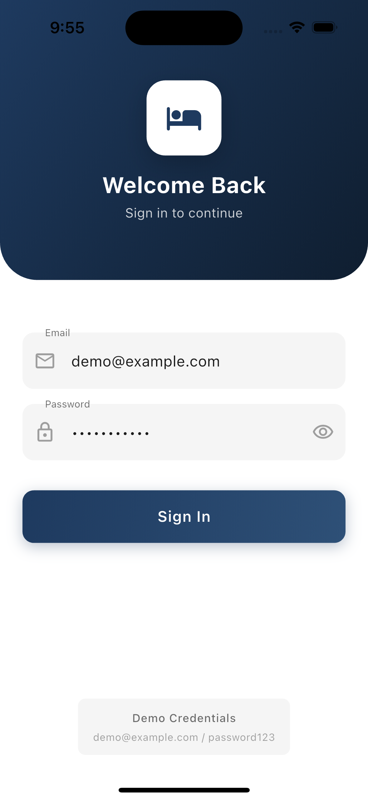
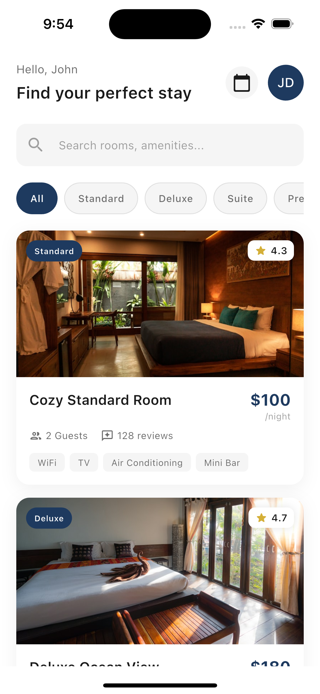
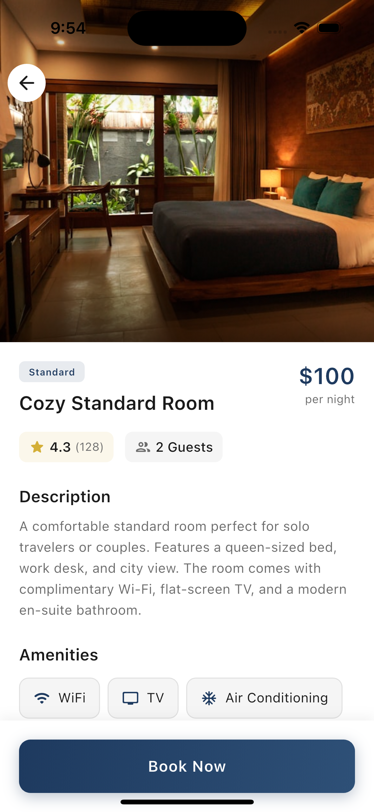
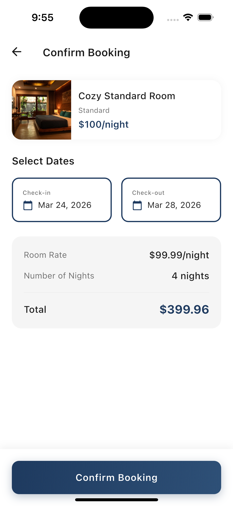
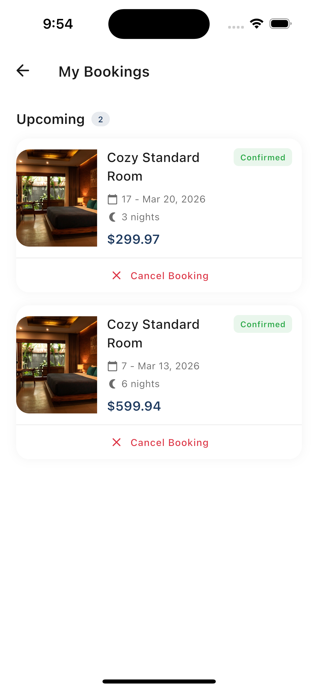

# Room Booking App

A Flutter mobile application for browsing and booking hotel rooms. Built with clean architecture principles and Riverpod state management.

## Features

- **Authentication**: Mock login with session persistence
- **Room Browsing**: View available rooms with search and filter options
- **Room Details**: Detailed view with amenities, pricing, and ratings
- **Booking Flow**: Select dates, check availability, and confirm bookings
- **My Bookings**: View upcoming, current, and past bookings with cancellation option

## Screenshots

<p align="center">
  
  
  
</p>

<p align="center">
  
  
</p>

| Screen | Description |
|--------|-------------|
| **Login** | Mock authentication with demo credentials |
| **Home** | Room listing with search and filter options |
| **Room Details** | Detailed view with amenities and pricing |
| **Confirmation** | Date selection and booking summary |
| **My Bookings** | View and manage your bookings |

## Tech Stack

- **Framework**: Flutter 3.38.2
- **State Management**: Riverpod
- **Local Storage**: Hive
- **Navigation**: go_router
- **Error Handling**: dartz (Either pattern)

## Prerequisites

- Flutter SDK (3.38.2 or higher)
- Dart SDK (3.0.0 or higher)
- Android Studio / VS Code with Flutter extensions
- iOS Simulator / Android Emulator or physical device

## Setup Instructions

### 1. Clone the Repository

```bash
git clone <repository-url>
cd room_booking_app
```

### 2. Install Dependencies

```bash
flutter pub get
```

### 3. Generate Hive Adapters

```bash
dart run build_runner build --delete-conflicting-outputs
```

### 4. Run the App

```bash
# For debug mode
flutter run

# For release mode
flutter run --release
```

### 5. Build APK (Optional)

```bash
flutter build apk --release
```

The APK will be generated at `build/app/outputs/flutter-apk/app-release.apk`

## Demo Credentials

Use the following credentials to log in:

| Email | Password |
|-------|----------|
| demo@example.com | password123 |
| test@example.com | test123 |

## Project Structure

```
lib/
├── core/
│   ├── constants/       # App constants
│   ├── errors/          # Failure classes
│   ├── theme/           # Colors, text styles
│   ├── utils/           # Validators, date utils
│   └── widgets/         # Reusable widgets
├── features/
│   ├── auth/            # Authentication
│   │   ├── data/
│   │   ├── domain/
│   │   └── presentation/
│   ├── bookings/        # Booking management
│   │   ├── data/
│   │   ├── domain/
│   │   └── presentation/
│   └── rooms/           # Room browsing
│       ├── data/
│       ├── domain/
│       └── presentation/
├── routes/              # App navigation
└── main.dart            # Entry point

assets/
└── mock/                # Mock JSON data
    ├── rooms.json
    └── users.json
```

## Architecture

The app follows a **feature-based clean architecture**:

- **Data Layer**: Datasources and repositories for data operations
- **Domain Layer**: Models and business entities
- **Presentation Layer**: Screens, providers, and widgets

For detailed architecture documentation, see [architecture-notes.txt](architecture-notes.txt).

## Key Implementations

### State Management
- `StateNotifierProvider` for complex state (auth, booking form)
- `FutureProvider` for async data fetching
- `StateProvider` for simple reactive values

### Data Persistence
- User session stored in Hive
- Bookings persisted locally
- Mock data loaded from JSON assets

### Error Handling
- Either pattern for operation results
- Visual feedback for errors
- Graceful degradation

## Running Tests

```bash
# Run all tests
flutter test

# Run with coverage
flutter test --coverage
```

## Troubleshooting

### Build Runner Issues
If you encounter issues with generated files:
```bash
flutter clean
flutter pub get
dart run build_runner build --delete-conflicting-outputs
```

### iOS Simulator Issues
Ensure you have Xcode installed and configured:
```bash
sudo xcode-select --switch /Applications/Xcode.app/Contents/Developer
sudo xcodebuild -runFirstLaunch
```

### Android Emulator Issues
Ensure Android SDK is properly configured:
```bash
flutter doctor
```

## License

This project is created for demonstration purposes as part of a technical assignment.